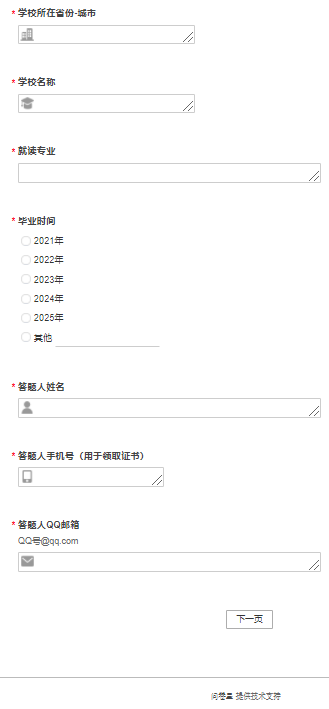
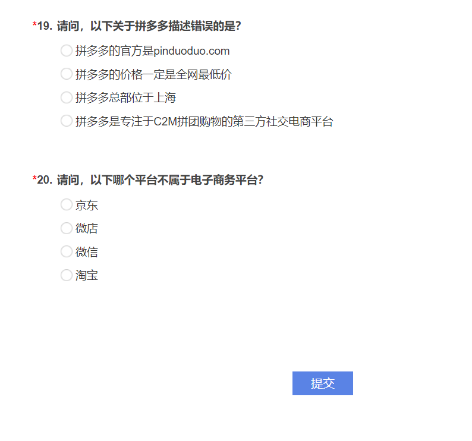

# 自动填写问卷工具

(English version is down below)

[Python库依赖](../../network/dependencies)

此程序使用Python的selenium库，使用前请确保电脑上已经安装了Google Chrome浏览器，并且在程序执行目录下放置了[Chrome Driver](https://chromedriver.chromium.org)

[此程序适用的问卷](http://contest.zhishijingsai.com.cn/jq/90306762.aspx?udsid=892160)，其它问卷只需要稍加改造即可

问卷内容展示：

## 链接

* [自动填写问卷工具 脚本](Tool-for-Autofill-Questionaire.py)

**警告**：

***仅供测试使用，不可用于任何非法用途！***

***对于使用本代码所造成的一切不良后果，本人将不负任何责任！***

# Tool for Autofill Questionaire

[Python library dependency](../../network/dependencies)

Using selenium to realize the function. Before using, make sure that Google Chrome browser is installed on the computer, and [Chrome Driver](https://chromedriver.chromium.org) is placed in the programme execution directory.

[The questionaire that suits for the program](http://contest.zhishijingsai.com.cn/jq/90306762.aspx?udsid=892160), other questionaires can be adapted easily.

Content of the questionaire:

## Links

* [Tool-for-Autofill-Questionaire Script](Tool-for-Autofill-Questionaire.py)

**Warning**:

***For TESTING ONLY, not for any ILLIGAL USE!***

***I will not be responsible for any adverse consequences caused by using this code.***
